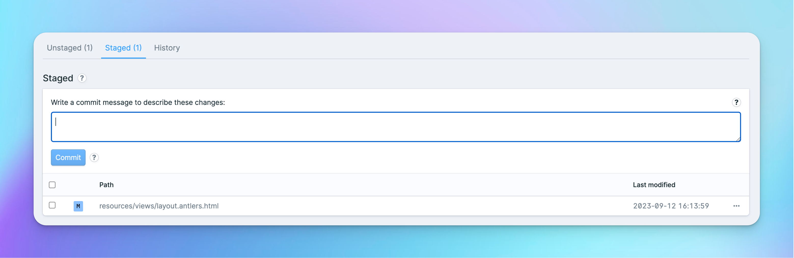

# ⏺ Creating commits

Ok, so you've reviewed the changes and staged the ones you want to make ready. Now it's time to commit.

### How to commit in Gitamic

Once you've got some staged changes, you will see the commit message box.

<figure><figcaption>
The commit message box only appears when needed
</figcaption></figure>

Any changes listed below the message box will be included in the commit.

Simply write a commit message ([be sure to make it a good one!](writing-commit-messages.md)) and click `Commit` and you're done!


You can use the `Cmd+Enter` (on macOS) or `Ctrl+Enter` (on other platforms) keyboard shortcut to save reaching for your mouse.

